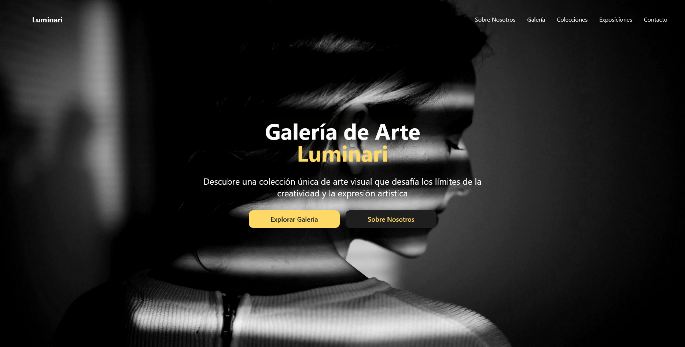

# 💡 Galería de Arte Luminari

Landing page inspirada en una galería de arte moderna, diseñada para ofrecer una experiencia visual innovadora, elegante y llamativa.

## 📸 Captura de Pantalla

## 🌐 Enlace al sitio

- [https://luminari-gallery.vercel.app/](https://luminari-gallery.vercel.app/)

## 🛠️ Tecnologías utilizadas

- Astro
- TailwindCSS
- GSAP
- JavaScript

## 👨‍💻 Autor

- GitHub - [GuidoPerezR](https://github.com/GuidoPerezR)
- X - [@GU1DZ3RO](https://x.com/GU1DZ3RO)

## 💭 Notas

Este proyecto me ayudo a fortalecer mis conocimientos en Astro, un framework que estoy aprendiendo y me gusto bastante para poder crear este tipo de páginas, TailwindCSS y GSAP, creando animaciones como las imagenes con efecto parallax o creando un scroll vertical para mostrar las colecciones con las que cuenta la galería.
